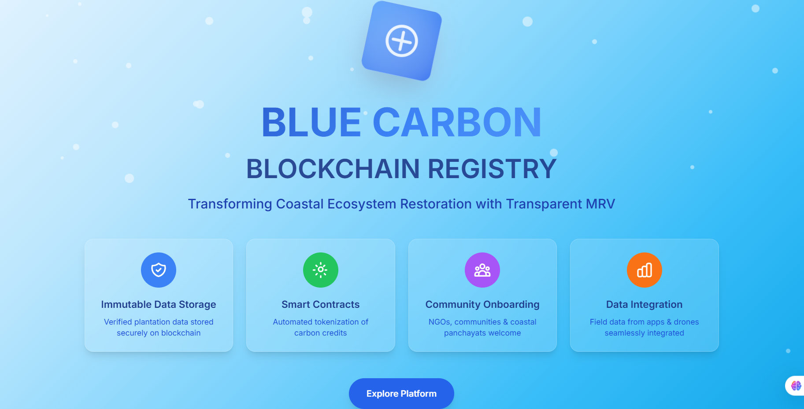
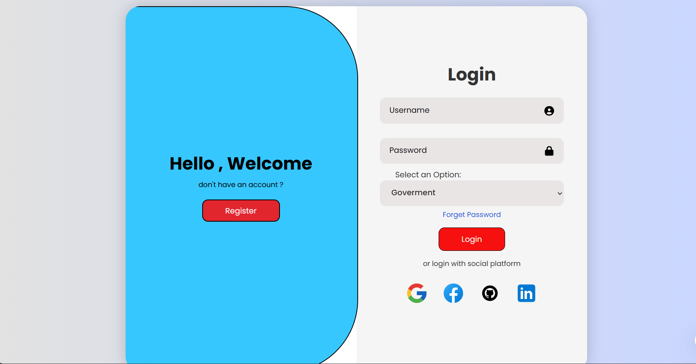
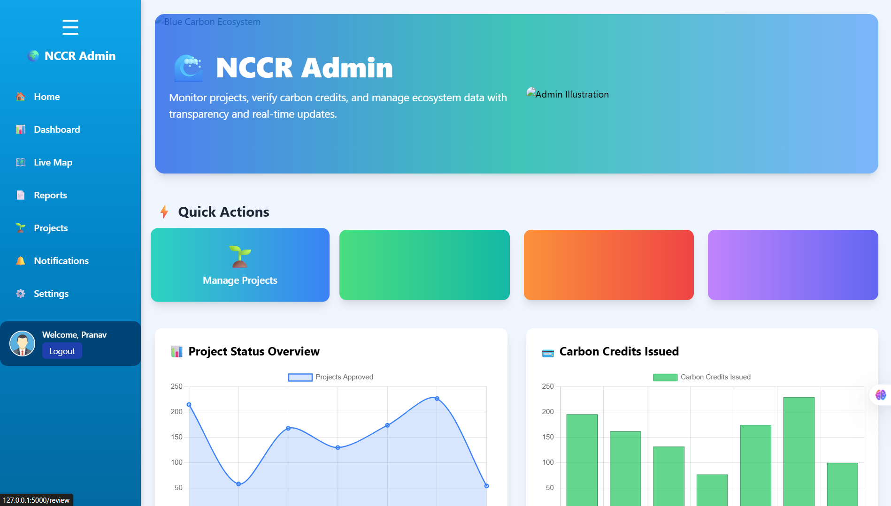
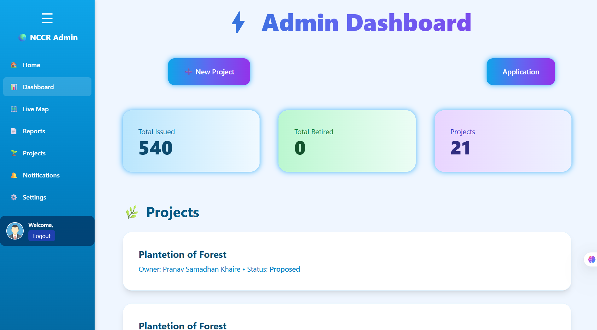
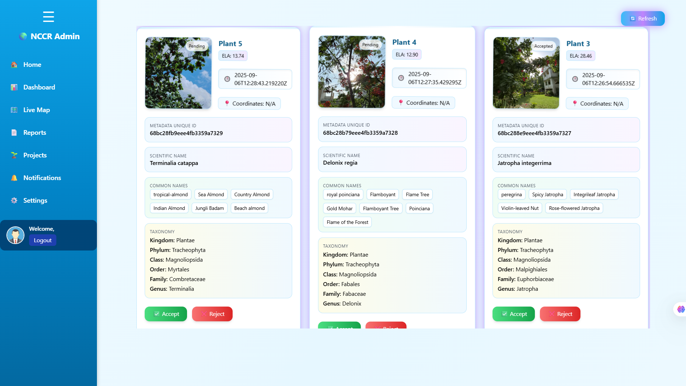
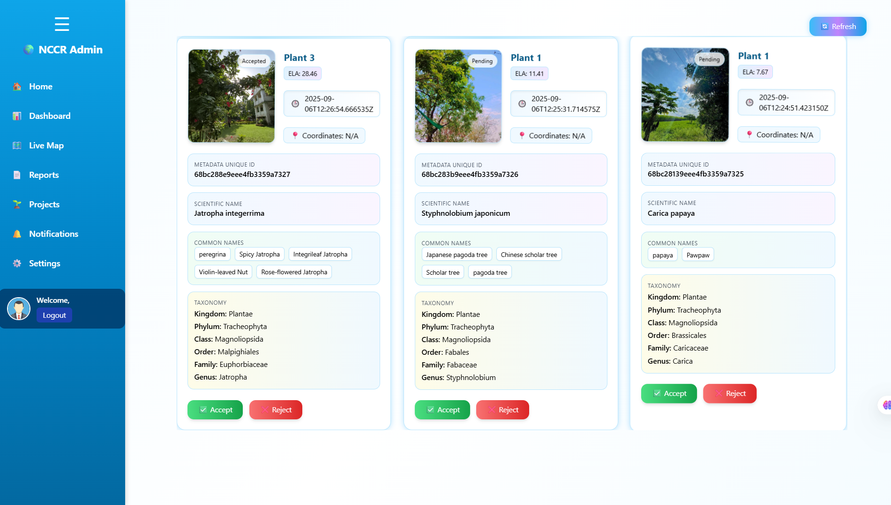
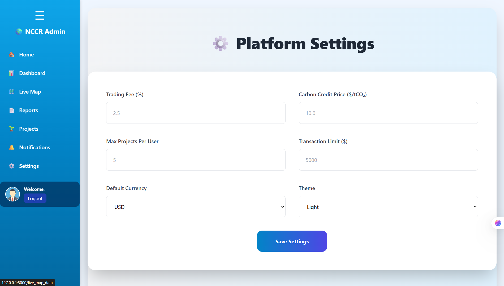
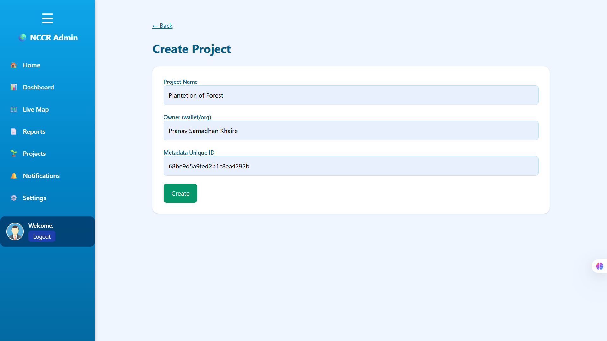
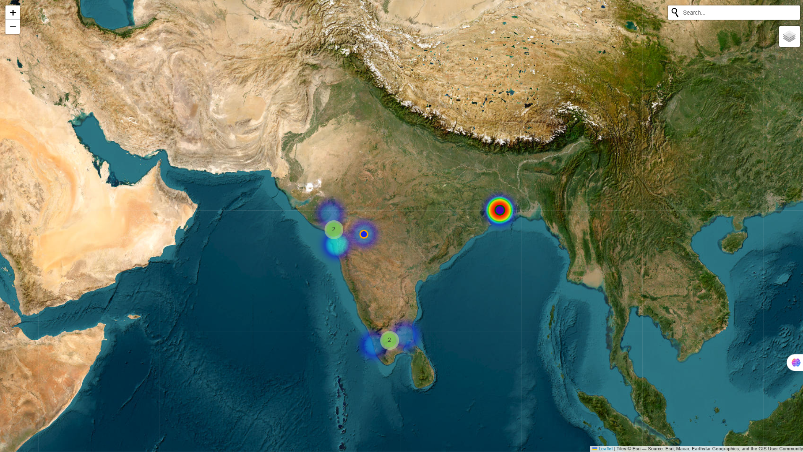

# 🌊 Blockchain-Based Blue Carbon Registry and MRV System  

## 📖 Introduction  

Blue carbon ecosystems — mangroves, seagrasses, and salt marshes — are among nature’s best allies in capturing carbon.  
Yet, verifying and tracking restoration projects is often **manual, fragmented, and open to manipulation**.  

This project is a **Flask-based web app** combined with **blockchain technology** to build a transparent **Blue Carbon Registry** and **MRV (Monitoring, Reporting & Verification) System**.  

The system:  
- Uses **blockchain-style hashing** to ensure data immutability.  
- Provides **ERC20 smart contract support** for tokenizing verified carbon credits.  
- Lets **NGOs and communities** upload plantation/restoration projects.  
- Enables **admins** (like NCCR or regulators) to verify projects before approval.  
- Shows results on **interactive maps, dashboards, and reports**.  

The goal is to make **climate project tracking tamper-proof, transparent, and ready for real-world tokenization**.  

---

## 🚀 Features  

- ✅ **Blockchain-like registry** – Immutable records using cryptographic hashing.  
- ✅ **ERC20 Smart Contract Simulation** – Tokenization of carbon credits with Solidity contracts.  
- ✅ **Web3 integration** – Connection between Flask backend and blockchain nodes.  
- ✅ **Interactive Folium maps** – Heatmaps, marker clusters, and geocoding.  
- ✅ **CSV/JSON uploads** – NGOs and communities can add project data easily.  
- ✅ **Drone and image analysis ready** – EXIF and metadata processing via Pillow.  
- ✅ **Admin dashboard** – Approve/reject projects, issue credits, and generate reports.  
- ✅ **Cross-platform development** – Tested in VS Code with smart contract tooling.  

---

## 🛠️ Tech Stack  

### 🔹 Backend & Framework  
- **Flask** → Python web framework  
- **Jinja2** → Template rendering  

### 🔹 Frontend & Libraries  
- **HTML5** → Structure of web pages  
- **CSS3** → Styling and layout  
- **JavaScript (ES6+)** → Interactivity and logic  
- **Tailwind CSS** → UI components & responsive design  
- **React.js** → Component-based UI framework  


### 🔹 Blockchain & Smart Contracts  
- **Solidity** → To write ERC20-based carbon credit contracts  
- **ERC20 Standard** → For fungible carbon tokens  
- **Web3.py** → Python → Blockchain integration  
- **Ganache / Hardhat** → Local Ethereum test environment  
- **MetaMask** → Wallet for testing transactions  
- **VS Code Solidity Tools** → Smart contract development  

### 🔹 Data & Storage  
- **MongoDB (pymongo, bson)** → Project datasets (flexible storage)  

### 🔹 Mapping & Visualization  
- **Folium** → Interactive maps  
- **MarkerCluster, HeatMap, Geocoder** → Folium plugins  

### 🔹 Image & Data Handling  
- **Pandas** → Data processing (CSV/Excel)  
- **Pillow (PIL)** → Image metadata & analysis  
- **JSON** → Configs and structured uploads  

### 🔹 Utilities  
- **Requests** → External API calls  
- **Datetime, os, io, base64** → File and encoding utilities  
- **Hashlib, Binascii** → Blockchain-style hashing  

---

## 📂 Project Structure  

```bash
blue-carbon-mrv/
│── app.py              # Main Flask file (routes, blockchain, Web3 integration, maps)
│── templates/          # HTML templates (Jinja2 + Bootstrap)
│── contract/           #  Blockchain contract
│── static/             # CSS, JS, image assets
│── data/               # Demo CSV/JSON datasets
│── models/             # ML models (optional for image classification)
│── requirements.txt    # All dependencies
│── README.md           # This documentation file
````

---

## ▶️ Demo

### 🎥 Project Video

[▶️ Watch demo video](/Video/Project%20Video%20.mp4)
---


# 📄 Project Documentation  

You can view the full documentation here:  

👉 [Download Documentation (PDF)](Documentation/Blur%20Carbon%20Creadit%20%20Documentation.pdf)  


### 📊 Flowcharts

.jpg)
.jpg)

## 🖼️ Screenshots & UI Preview  

Here’s a quick walkthrough of the user interface and features:  

---

### 🏠 Welcome Page  
  

---

### 🔑 Login Page  
  

---

### 📊 Main Dashboard  
.jpg)  

---

### 📤 Project Upload Page  
.png)  

---

### 🖼️ Image Report Generator  
.png)  

---

### 🛡️ Admin Home 
  

---
### 🛡️ Admin Dashboard  
  

---

### 📱 Applications View (Accept or Reject) 
  
  

---

### ⚙️ Admin Tools  
  

---

### 📑 Project Creation  
  

---

### 🧑‍⚖️ Admin Controls  
(Manage visits, carbon credit creation/rejection, and verification)  
  

---

### 🌍 Verified Project on Map  
.jpg)  
  

---

## 📦 Installation

### 1. Clone the repository

```bash
git clone https://github.com/pranav16-king/blue-carbon-mrv.git
cd blue-carbon-mrv
```

### 2. Create virtual environment

```bash
python -m venv venv
```

Activate it:

```bash
# Windows
venv\Scripts\activate
# Linux/Mac
source venv/bin/activate
```

### 3. Install dependencies

```bash
pip install -r requirements.txt
```

---

## ▶️ Run the App

```bash
python app.py
```

Open in browser:
👉 `http://127.0.0.1:5000/`

Default login:

* **Username:** `Pranav`
* **Password:** `Pranav@123`

---

## 🌍 Example Workflow

1. NGO uploads survey + drone images and CSV/JSON datasets.
2. Data is hashed and added to a blockchain-like registry.
3. Admin verifies the submission.
4. Smart contract issues **ERC20-based carbon tokens**.
5. Dashboard and map show approved projects with credits.
6. Tokenized credits can be integrated with **marketplaces or exchanges**.

---

## 🔮 Future Scope

* Deploy **smart contracts** on Polygon/Ethereum testnets.
* Create a **marketplace** for verified carbon credit trading.
* Add **AI models** to detect mangroves, seagrass, and salt marshes from satellite images.
* Build a **mobile app** for field officers with geo-tagged uploads.
* Expose **APIs** for government, NGOs, and UN climate registries.

---
## 👨‍👩‍👧‍👦 Team – Smart India Hackathon 2025  

- [👨‍💻 **Pranav Khaire**](https://github.com/pranav16-king) – Group Leader | 🔗 Blockchain Developer | ⚙️ Backend  
- [🎨 **Piyush Jaybhaye**](https://github.com/PiyushJaybhaye) – 💻 Frontend Developer | 🖌️ UI/UX Designer | 🎬 Video Editing & 📊 PPT  
- [📑 **Jaya Kharate**](https://github.com/JayaSKharate77) – ⚙️ Backend Developer | 📝 Documentation  
- [🏗️ **Sakshi Alane**](https://github.com/Sakshi270) – ⚙️ Backend Developer | 🏛️ Architecture Designer  
- [🖥️ **Sakshi Bikkad**](https://github.com/SAKSHIBIKKAD) – 💻 Frontend Developer | 📢 Presentation  
- [👨‍💻 **Satyadeep Kharat**](https://github.com/satyadeep09) – 🎨 Backend Developer | 📊 Data Visualization


---

## 📜 License

## © Copyright Notice  

© 2025 Pranav Khaire (Group Leader), Piyush Jaybhaye, Jaya Kharate,  
Sakshi Alane, Sakshi Bikkad and Satyadeep Kharat. All Rights Reserved.  


